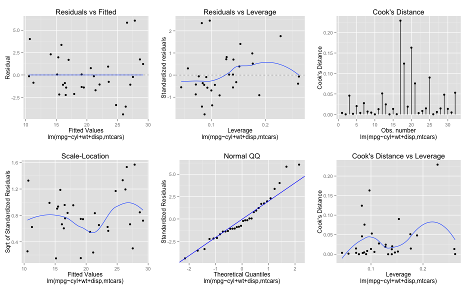

## Executive Summary

- Can you trust the Miles Per Gallon (MPG) advertised on a used vehicle from 1974?
- How much has fuel effeciency changed since 1974 for a vehicle with the same specifications?

Using this ShinnyApp, it's ridiculously easy to answer these questions! This web based application runs natively in your web browser, without the need to install anything. 

This ShinnyApp is able to predict with user defined degrees of confidece, with only 3 data points about the vehicle in question. All you need to do is enter in the desired `Cylinders`, `Displacement`, `Weight`, and `Confidence Interval` of the vehicle from 1974 you would like to predict Miles Per Gallon (MPG) on.

The prediction function fits a linear model using the `mtcars` dataset which was extracted from the 1974 Motor Trend US magazine, for 32 automobiles (1973–74 models). Using the formula `mpg ~ cy+wt+disp`.

https://szelenka.shinyapps.io/devdataprod-project/

--- .class #id 

## Analysis of Variance


```r
summary(aov(lm(mpg~.,mtcars)))
```

```
##             Df Sum Sq Mean Sq F value Pr(>F)    
## cyl          1    818     818  116.42  5e-10 ***
## disp         1     38      38    5.35 0.0309 *  
## hp           1      9       9    1.33 0.2610    
## drat         1     16      16    2.34 0.1406    
## wt           1     77      77   11.03 0.0032 ** 
## qsec         1      4       4    0.56 0.4617    
## vs           1      0       0    0.02 0.8932    
## am           1     14      14    2.06 0.1659    
## gear         1      1       1    0.14 0.7137    
## carb         1      0       0    0.06 0.8122    
## Residuals   21    147       7                   
## ---
## Signif. codes:  0 '***' 0.001 '**' 0.01 '*' 0.05 '.' 0.1 ' ' 1
```

---

## Model Selection


```r
fit = lm(mpg~cyl+wt+disp,mtcars)
```
- From the Analysis of Variance output in the previous slide, we can see Cylinder (`cyl`), Displacement (`disp`), and Weight (`wt`) have a value below 5% and are considred influential towards the response variable Miles Per Gallon (`mpg`).
- The proportion of the variation explained by these selected features is 0.8326.
- 83.2607% considered `strong positively related`!
- Residuals plot (next slide) implies a good fit of the data, because the number and degree of positive residuals is offset by an apparent equal number and degree of negative residuals.
- This implies our training data is pretty good to model unknown data points against, and the prediction model used in this ShinyApp.

---

## Graphs

 
